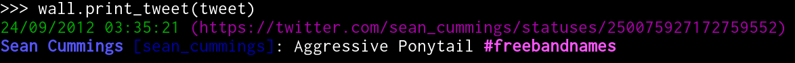

CLI walls examples
==================

You can use or extend ``CLIWall`` and ``CLIColorfulWall`` to display
tweets in different way. We use ``click`` as the printer but every
object implementing methods ``echo``, ``clear`` (and for styling also
``style`` and ``secho``) can be used. The Tweet object in following
examples is the same as in :doc:`tweet`.

CLIWall examples
----------------

.. testsetup::

    from twitterwall.common import Tweet
    from twitterwall.cli import CLIWall
    import click

    tweet = Tweet({
      "created_at": "Mon Sep 24 03:35:21 +0000 2012",
      "id_str": "250075927172759552",
      "entities": {
        "urls": [],
        "hashtags": [
          {
            "text": "freebandnames",
            "indices": [20, 34]
          }
        ],
        "user_mentions": []
      },
      "text": "Aggressive Ponytail #freebandnames",
      "retweet_count": 0,
      "id": 250075927172759552,
      "retweeted": False,
      "user": {
        "name": "Sean Cummings",
        "profile_image_url": "http://a0.twimg.com/profile_images/2359746665/1v6zfgqo8g0d3mk7ii5s_normal.jpeg",
        "created_at": "Mon Apr 26 06:01:55 +0000 2010",
        "location": "LA, CA",
        "profile_image_url_https": "https://si0.twimg.com/profile_images/2359746665/1v6zfgqo8g0d3mk7ii5s_normal.jpeg",
        "id": 137238150,
        "followers_count": 70,
        "verified": False,
        "time_zone": "Pacific Time (US & Canada)",
        "description": "Born 330 Live 310",
        "profile_background_image_url": "http://a0.twimg.com/images/themes/theme1/bg.png",
        "statuses_count": 579,
        "friends_count": 110,
        "screen_name": "sean_cummings"
      },
      "source": "Twitter for Mac"
    })

.. doctest::

    >>> wall = CLIWall(click)
    >>> wall.print_tweet(tweet)
    24/09/2012 03:35:21 (https://twitter.com/sean_cummings/statuses/250075927172759552)
    Sean Cummings [sean_cummings]: Aggressive Ponytail #freebandnames
    <BLANKLINE>

CLIColorfulWall examples
------------------------

.. testsetup::

    from twitterwall.common import Tweet
    from twitterwall.cli import CLIColorfulWall
    import click

    tweet = Tweet({
      "created_at": "Mon Sep 24 03:35:21 +0000 2012",
      "id_str": "250075927172759552",
      "entities": {
        "urls": [],
        "hashtags": [
          {
            "text": "freebandnames",
            "indices": [20, 34]
          }
        ],
        "user_mentions": []
      },
      "text": "Aggressive Ponytail #freebandnames",
      "retweet_count": 0,
      "id": 250075927172759552,
      "retweeted": False,
      "user": {
        "name": "Sean Cummings",
        "profile_image_url": "http://a0.twimg.com/profile_images/2359746665/1v6zfgqo8g0d3mk7ii5s_normal.jpeg",
        "created_at": "Mon Apr 26 06:01:55 +0000 2010",
        "location": "LA, CA",
        "profile_image_url_https": "https://si0.twimg.com/profile_images/2359746665/1v6zfgqo8g0d3mk7ii5s_normal.jpeg",
        "id": 137238150,
        "followers_count": 70,
        "verified": False,
        "time_zone": "Pacific Time (US & Canada)",
        "description": "Born 330 Live 310",
        "profile_background_image_url": "http://a0.twimg.com/images/themes/theme1/bg.png",
        "statuses_count": 579,
        "friends_count": 110,
        "screen_name": "sean_cummings"
      },
      "source": "Twitter for Mac"
    })

.. doctest::

    >>> wall = CLIColorfulWall(click)
    >>> wall.print_tweet(tweet)
    24/09/2012 03:35:21 (https://twitter.com/sean_cummings/statuses/250075927172759552)
    Sean Cummings [sean_cummings]: Aggressive Ponytail #freebandnames
    <BLANKLINE>

Only difference is that ``click`` will colorize and use bold/underline styling
if the terminal allows it. For better understanding see picture below (from XFCE4
terminal):

|CLI with colors|

