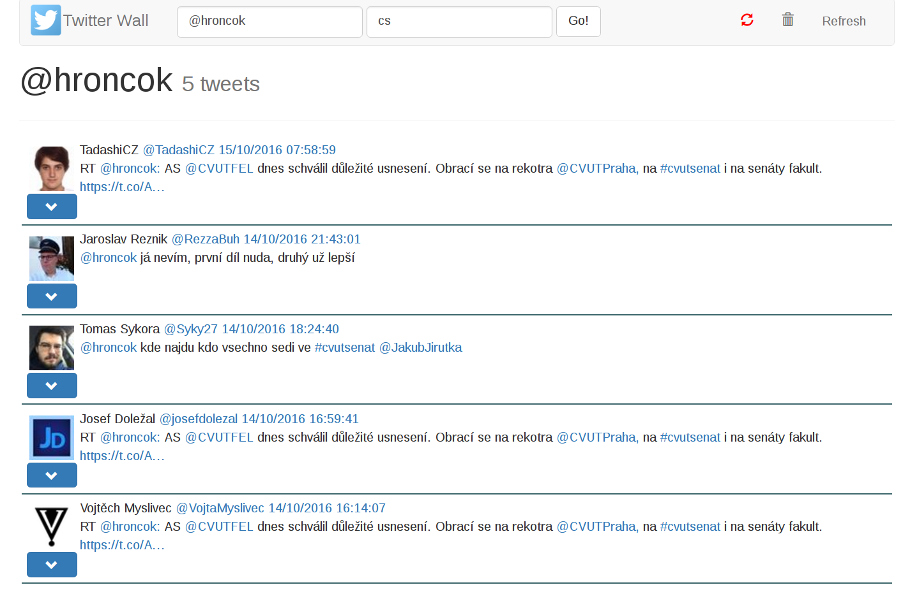
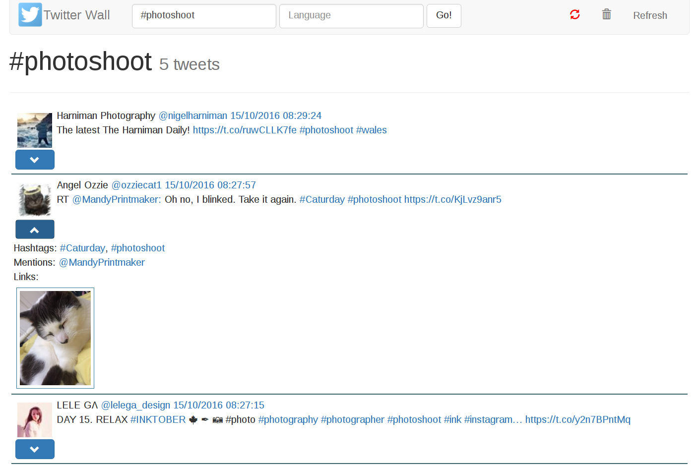
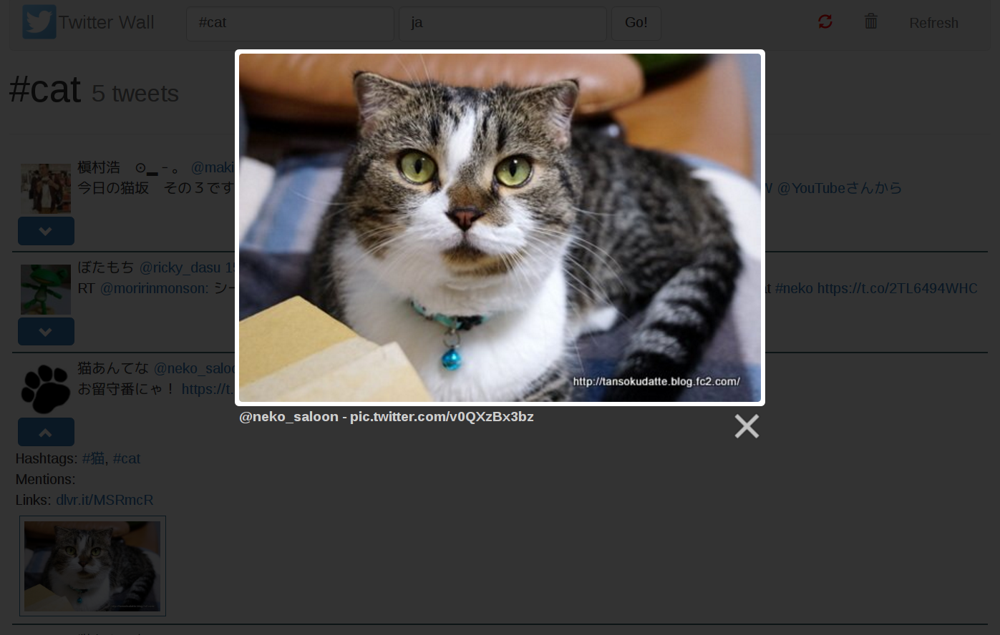

WEB
===

WEB interface is made by `Flask`_ & `Jinja`_. It uses also `Twitter Bootstrap`_,
`jQuery`_ and `Lightbox`_ (local files only, no CDN).

Main ideas are same as for :doc:`CLI` interface. You just start web app with defined
(or default) count of initial tweets displayed and/or interval of loading next
tweets via AJAX. You can also run in flask debugging mode. The query and language
is set by user of web interface (by URL).

In the web interface user can moreover turn on/off AJAX loading, clear screen or
just refresh the page. For each tweet there is button for hide/show details that
consists of entities: hashtags, mentions, links and photos. For nicer photos
browsing is used the Lightbox.

*Running example*: `mareksuchanek.pythonanywhere.com`_

Routes
------

-  ``/`` = landing
-  ``/q/<query>[/<lang>]`` = web interface for requested query in
   defined language
-  ``/api/<lid>/<query[/<lang>]`` = API used by AJAX for loading
   additional tweets

Web launch examples
-------------------

Here is also ``--help`` as is for the ``cli`` command:

::

    twitterwall web --help

Start web interface with loading 7 tweets at start and 10 seconds
interval of AJAX requests (when turned on by user).

-  *NOTE*: Minimal value of interval is defined as 3 seconds.

::

    twitterwall web --count 7 --interval 10
    twitterwall web -n 7 -i 10

Start web interface with default values (5 tweets and 5 seconds), but
turn on debugging.

-  *NOTE*: Should not be used on production! 😖

::

    twitterwall web --debug

Screenshots
-----------

Basic Twitter Wall with **@hroncok** query:

|Basic tweets list with “@hroncok” query|

Tweets with **#photoshoot** query with one tweet details shown (2
hashtags, 1 mention, 0 links and 1 picture):

|Tweets list with “#photoshoot” query with one tweet details shown|

Enlarged photo of cat 😺 via `Lightbox`_:

|Enlarged photo of cat via Lightbox|

.. _Flask: http://flask.pocoo.org
.. _Jinja: http://jinja.pocoo.org
.. _Twitter Bootstrap: http://getbootstrap.com
.. _jQuery: https://jquery.com
.. _Lightbox: http://lokeshdhakar.com/projects/lightbox2/
.. _mareksuchanek.pythonanywhere.com: http://mareksuchanek.pythonanywhere.com/

